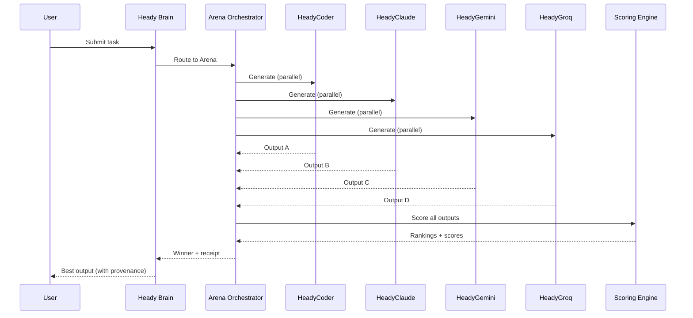

<!--
  © 2026 Heady Systems LLC.
  PROPRIETARY AND CONFIDENTIAL.
  Unauthorized copying, modification, or distribution is strictly prohibited.
-->
# Arena Mode — Technical Deep Dive

## What Is Arena Mode?

Arena Mode is Heady's signature quality assurance mechanism. Instead of trusting a single AI model, Arena Mode pits **multiple specialized AI nodes** against each other on the same task. The best output wins through transparent scoring.

## How It Works



## Scoring Criteria

| Criterion | Weight | Description |
|-----------|--------|-------------|
| **Correctness** | 35% | Does the output solve the task correctly? |
| **Quality** | 25% | Code style, readability, best practices |
| **Performance** | 15% | Time/space complexity, efficiency |
| **Safety** | 15% | No security vulnerabilities, no data leaks |
| **Creativity** | 10% | Novel approaches, elegant solutions |

## Arena Modes

| Mode | Nodes | Use Case |
|------|-------|----------|
| **Quick** | 2 nodes | Fast iteration, low-stakes tasks |
| **Standard** | 4 nodes | Default for most development tasks |
| **Full** | 7 nodes | Critical code, production deployments |
| **Custom** | User-selected | Specific node combinations for domain tasks |

## Trust & Proof Receipts

Every Arena battle generates a **receipt** containing:

- All node outputs (full text)
- Scoring breakdown per criterion
- Winner selection rationale
- Execution time per node
- Cost per node (token usage)
- Reproducibility seed (for auditing)

## Monte Carlo Integration

Before executeing any Arena-winning output, the Monte Carlo engine:

1. Assesses risk factors (error rates, deployment history, system health)
2. Runs 10,000 simulations with the proposed change
3. Returns confidence bounds and risk grade
4. Only GREEN/YELLOW grades auto-proceed; ORANGE/RED require human approval

## CLI Usage

```bash
# Quick 2-node battle
heady battle --mode quick "Implement a rate limiter in Node.js"

# Full 7-node arena
heady battle --mode full "Refactor auth middleware for JWT validation"

# View leaderboard
heady battle --leaderboard

# Compare specific nodes
heady battle --compare HeadyCoder HeadyClaude "Build a REST API"
```

## Why Arena Mode Matters for Enterprise

1. **Auditable Quality** — Every output has a scoring receipt
2. **Model-Agnostic** — Not locked into one provider; uses the best for each task
3. **Cost Transparency** — See exactly what each node costs per task
4. **Reproducible** — Seeds allow re-running the exact same battle for compliance
5. **Continuous Improvement** — Node leaderboards show which models improve over time
