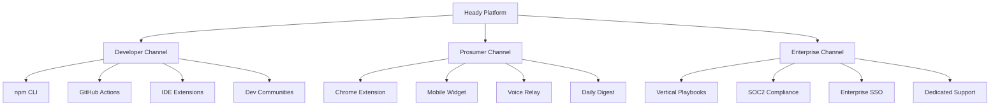

<!--
  © 2026 Heady Systems LLC.
  PROPRIETARY AND CONFIDENTIAL.
  Unauthorized copying, modification, or distribution is strictly prohibited.
-->
# Flood Strategy — Distribution & Growth Plan

## Three Channels

### 1. Developer Virality (Primary)

**Goal**: Make Heady indispensable for developers within 90 days.

| Tactic | Timeline | KPI |
|--------|----------|-----|
| npm global CLI (`heady-hive-sdk`) | Week 1 | 1,000 installs |
| GitHub Actions marketplace | Week 2 | 500 repos |
| VS Code / Windsurf extension | Week 4 | 2,000 installs |
| Dev.to / Hacker News launch | Week 6 | 10,000 impressions |
| Arena Mode playground (web) | Week 8 | 5,000 battles |

**Key message**: *"One CLI, 20 AI nodes, Arena-tested quality."*

### 2. Prosumer Habit Formation (Secondary)

**Goal**: HeadyBuddy becomes the daily AI companion.

| Tactic | Timeline | KPI |
|--------|----------|-----|
| Chrome extension (new tab + overlay) | Week 1 | 5,000 users |
| Cross-device sync (phone → desktop) | Week 4 | 2,000 synced devices |
| Voice dictation relay | Week 8 | 1,000 active voice users |
| Personalized daily digest | Week 12 | 60% DAU retention |

**Key message**: *"Your AI buddy, everywhere you work."*

### 3. Enterprise Trust (Tertiary)

**Goal**: SOC2-ready, audit-trailed, policy-enforced AI.

| Tactic | Timeline | KPI |
|--------|----------|-----|
| SBOM + container scanning | Week 1 | Automated |
| Policy engine (RBAC + approval gates) | Week 2 | Live |
| Audit trail export (GDPR/CCPA) | Week 4 | Compliance-ready |
| Vertical playbooks (17 industries) | Week 8 | 5 enterprise pilots |
| SOC2 Type II preparation | Week 16 | Audit started |

**Key message**: *"Enterprise AI with Arena-verified quality and full audit trails."*

---

## Distribution Channels

## Growth Flywheel

1. Developer uses CLI → discovers Arena Mode → tells team
2. Team adopts for codebase → requests enterprise features
3. Enterprise deal → more nodes trained on domain → better Arena results
4. Better results → more developers adopt → flywheel accelerates

## Risk Mitigations

| Risk | Mitigation |
|------|------------|
| Low initial adoption | Free tier with no credit card required |
| Enterprise sales cycle length | Self-serve pilot with usage-based upgrade |
| Competitor moat | 20 specialized nodes > 1 general model |
| Security concern | SBOM, container scan, policy engine from day 1 |
| Churn | Daily Buddy engagement + cross-device sync creates habit |
