# Heady Service Catalog
>
> **Canonical inventory of every service, component, and AI node.** Last Updated: 2026-02-24

## Architecture Layers

```mermaid
graph TB
    subgraph Edge["☁️ Edge Layer"]
        CF[Cloudflare Tunnel]
        EW[Edge Worker]
    end

    subgraph Gateway["🚪 Gateway Layer"]
        HM[HeadyManager :3301]
    end

    subgraph Intelligence["🧠 Intelligence Layer"]
        HCB[HCBrain]
        HP[HeadyPromoter]
        HC[HeadyCoder]
    end

    subgraph AI["🤖 AI Nodes"]
        CL[Claude] & CX[Codex] & GM[Gemini]
        PX[Perplexity] & CP[Copilot] & JL[Jules] & GK[Grok]
    end

    subgraph Resilience["🛡️ Resilience Layer"]
        CB[Circuit Breakers]
        CA[Caches]
        PL[Connection Pools]
    end

    subgraph Sites["🌐 Website Layer"]
        S1[HeadyBuddy :9000]
        S2[HeadySystems :9001]
        S3[HeadyConnection :9002]
        S4[HeadyMCP :9003]
        S5[HeadyIO :9004]
        S6[HeadyMe :9005]
        SW[HeadyWeb :3000]
        SA[Admin UI :5173]
    end

    CF --> HM
    EW --> HM
    HM --> HP --> HCB
    HCB --> CL & CX & GM & PX & CP & JL & GK
    HM --> CB & CA & PL
    CF --> S1 & S2 & S3 & S4 & S5 & S6 & SW & SA
```

## Core Components

| Component | Version | Type | Criticality | Source of Truth |
|-----------|---------|------|-------------|-----------------|
| HeadyPromoter | 4.0.0 | Orchestration | 🔴 Critical | `src/hc/HeadyPromoter.js` |
| HeadyManager | 3.3.0 | Gateway | 🔴 Critical | `heady-manager.js` |
| HeadyLens | 3.3.0 | Monitoring | 🔴 Critical | `src/monitoring/health-monitor.js` |
| HeadyCoder | 3.3.0 | Coding | 🔴 Critical | `src/hc/HeadyCoder.js` |
| HCBrain | 3.3.0 | Intelligence | 🔴 Critical | `src/hcbrain.js` |
| HC-Supervisor | 1.0.0 | Supervision | 🟡 High | `src/hc/Supervisor.js` |
| MC Plan Scheduler | 2.0.0 | Planning | 🟡 High | `configs/plans/*.yaml` |
| HeadyMaintenance | 1.0.0 | Governance | 🟡 High | `configs/file-governance.yaml` |

## AI Nodes

| Node | Role | Default Model | Latency | Cost | Quality |
|------|------|---------------|---------|------|---------|
| HeadyClaude | Primary Architect | Claude Opus 4.6 | Medium | $5/$25/MT | Very High |
| HeadyCodex | Primary Executor | GPT-5.3 Codex | Low | $2/$14/MT | Very High |
| HeadyGemini | Logic Specialist | Gemini 3.1 Pro | Medium | $2/$12/MT | Very High |
| HeadyPerplexity | Research | Sonar Pro | Medium | $3/$15/MT | High |
| HeadyCopilot | IDE Completion | GitHub Copilot | Low | Subscription | High |
| HeadyJules | Orchestrator | Internal | Low | Low | High |
| HeadyGrok | Adversarial Validator | Grok-4 | Medium | $3/$15/MT | Very High |

## Resilience Primitives

| Primitive | Count | Coverage |
|-----------|-------|----------|
| Circuit Breakers | 16 | brain, soul, conductor, hcfp, patterns, ops, maintenance, registry, auto-success, cloud, edge-ai, claude, codex, gemini, perplexity, grok |
| Named Caches | 5 | conductor (5s TTL), registry (30s), patterns (2min), ai (10s), health (15s) |
| Connection Pools | 5 | cloud (8 max), file (20), ai (6), edge (15), database (10) |

### API Endpoints

- `GET /api/resilience/status` — Full dashboard
- `GET /api/resilience/breakers` — Circuit breaker states
- `POST /api/resilience/breakers/:name/reset` — Manual reset
- `GET /api/resilience/caches` — Cache hit rates
- `GET /api/resilience/pools` — Pool utilization

## Cloud Providers

| Provider | Status | Services |
|----------|--------|----------|
| Cloudflare | ✅ Active | DNS, Tunnel, Workers, KV, Vectorize, Pages, Access |
| Google Cloud | ⚙️ Configured | Vertex AI, Cloud Run, Colab, Cloud Storage |
| GitHub | ✅ Active | Repos, Actions CI/CD, Pages |
| LiteLLM | ✅ Active | Multi-Model Proxy, Key Management |

## Security Gates

| Gate | Status | File |
|------|--------|------|
| Pre-commit Hook | ✅ Installed | `scripts/hooks/pre-commit.sh` |
| Secret Scanning | ✅ Active | Runs on every commit |
| File Type Blocking | ✅ Active | .pid, .bak, .log, .jsonl blocked |
| Localhost Detection | ✅ Active | Warns on localhost in production code |
| File Size Check | ✅ Active | Warns on files >500KB |
